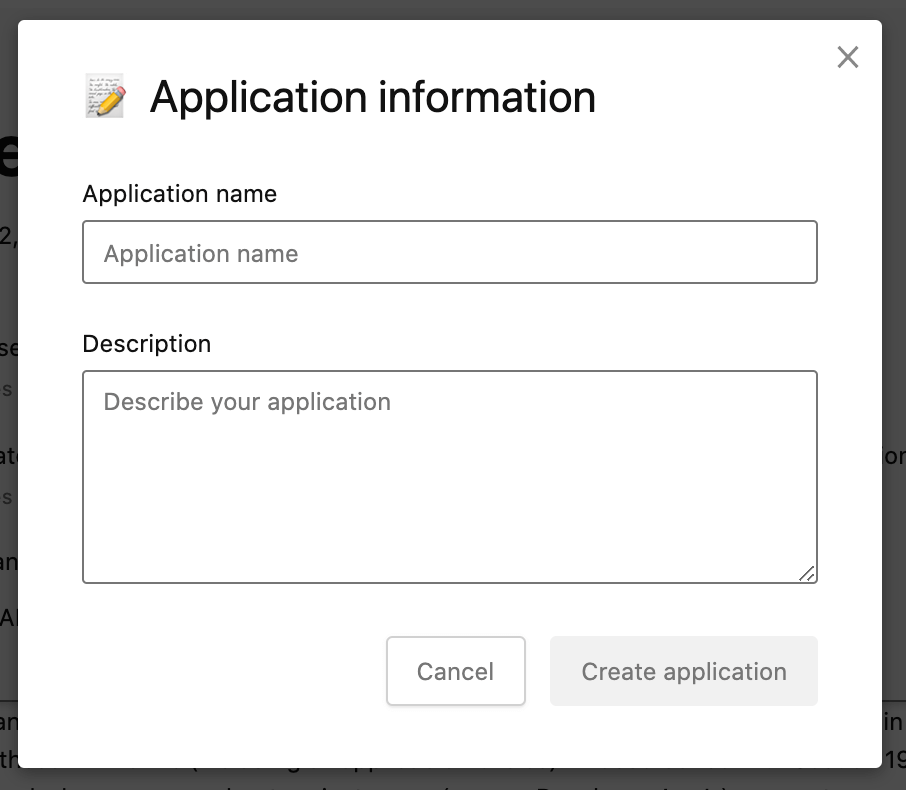
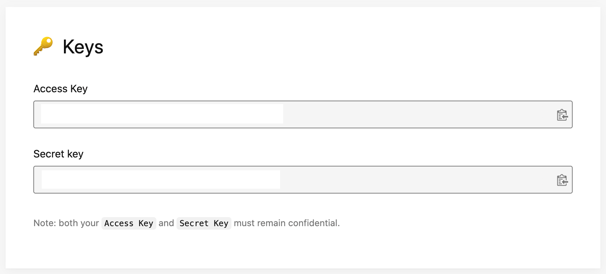

# Using Next.js with Unsplash API

This is an example of how [Unsplash](https://unsplash.com/) can be used with `Next.js`

## Demo

[https://nextjs-with-unsplash.vercel.app](https://nextjs-with-unsplash.vercel.app/)

## Deploy your own

Deploy the example using [Vercel](https://vercel.com/now):

[](https://vercel.com/import/project?template=https://github.com/vercel/next.js/tree/canary/examples/with-unsplash)

## How to use

### Using `create-next-app`

Execute [`create-next-app`](https://github.com/vercel/next.js/tree/canary/packages/create-next-app) with [npm](https://docs.npmjs.com/cli/init) or [Yarn](https://yarnpkg.com/lang/en/docs/cli/create/) to bootstrap the example:

```bash
npx create-next-app --example with-unsplash with-unsplash-app
# or
yarn create next-app --example with-unsplash with-unsplash-app
```

### Download manually

Download the example:

```bash
curl https://codeload.github.com/vercel/next.js/tar.gz/canary | tar -xz --strip=2 next.js-canary/examples/with-unsplash
cd with-unsplash
```

Install it and run:

```bash
npm install
npm run dev
# or
yarn
yarn dev
```

## Configuration

### Step 1. Create an account on Unsplash

First, you need to [create an account on Unsplash](https://unsplash.com/).

### Step 2. Crate an app on Unsplash

Then you need to [crate an app on Unsplash](https://unsplash.com/oauth/applications/new)


You have to accept terms


Fill the form with app name and description



After creating the app, you’ll be presented with the API key. We’ll use this in the next step.



### Step 3. Set up environment variables

Create .env.local file:

```bash
UNSPLASH_ACCESS_KEY=YOUR_API_KEY
UNSPLASH_USER=ANY_UNSPLASH_USERNAME
```

Deploy it to the cloud with [Vercel](https://vercel.com/import?filter=next.js&utm_source=github&utm_medium=readme&utm_campaign=next-example) ([Documentation](https://nextjs.org/docs/deployment)).

Important: When you import your project on Vercel, make sure to click on Environment Variables and set them to match your .env.local file.
